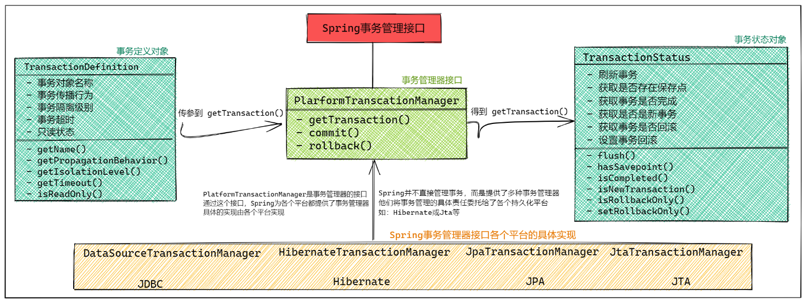

# Spring事务

### 一.Spring事务管理器

#### 1.Spring事务管理结构

##### 1.Spring事务核心接口

### 3.Spring事务实现

#### 1.Spring编程式事务

##### 1.XML+Annotation（jdbcTemplate)

- 配置applicationContext.xml配置文件

配置xml文件.png)

- 编写Service层（具体事务）

编写service层.png)

- 测试事务

测试事务.png)

##### 2.XML+Annotation（TransactionTemplate)

- 配置applicationContext.xml配置文件

配置xml文件.png)

- 编写Service层（具体事务）

编写service层.png)

- 测试事务

测试事务.png)

